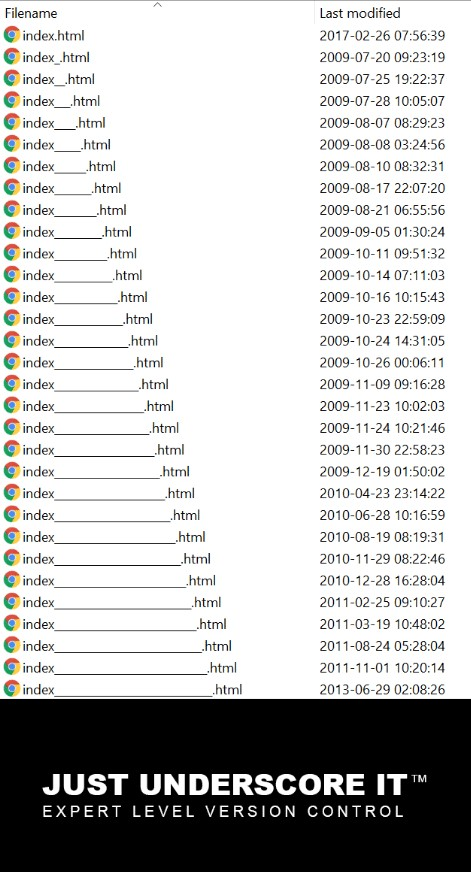

#	On Boarding Guide
**Rıza Özçelik (Based on a previous version by Utkan Gezer)**

**October 28, 2020**

### Introduction

🎊🎊Hello CMPE250 Folks! Welcome to CMPE 250: Data Structures \& Algorithms! 🎊🎊

Though this is an online edition 😷, we aim to make this course as fun as it gets and make us all enjoy the semester. This course will help you learn essential computer engineering skills, including complexity analysis, algorithm design, and data structures, a skill set that you will utilize throughout your career. But, most importantly, you will have fun in this course! 🥳🥳 So, let us all get on board, shall we? 🚀

We know that you love programming projects and we also know that they have a cool side-effect as being very useful for your learning. 👩‍💻👨‍💻 So, there will not be any shortage of them! We will have **five** programming projects that would require the knowledge of C++. No worries, though, we will spend a considerable amount of time on C++ as part of the course material. The projects also need you to be familiar with [Virtual Machines (VMs)](#virtual-machines), [terminal](#terminal), and [git](#git). This is why we prepared this document! 

### Virtual Machines
VMs are simply great! They are operating systems (OS) that can be run inside almost any operating system. 😲Thus, we prepared an OS for you, a Lubuntu environment, that you can run with a double-click from your desktop! All thanks to VMs...

Before proceeding to the setup, let us agree on the definitions of some terms:

- **Operation System (OS):**  A software that manages the hardware operations and provides easy-to-use services for other programs. Examples: Windows 10, macOS Mojave, Ubuntu...
- **Virtualizer:** An application that enables to run virtual machines inside OS. Examples: VirtualBox, VMWare.
- **Host OS:** In the context of virtualization (running a virtual machine), the OS that runs the virtual machine. For instance, I use Windows in my computer and run Lubuntu as a virtual machine, making Windows the host.
- **Guest OS:**  The virtualized OS running inside a virtual machine. In the previous example Lubuntu is the guest OS.

Now let us set up the VM. 

1. First things first! Download the virtual machine through [this link](http://cmpe.boun.edu.tr/~riza.ozcelik/cmpe250/CMPE250-Lubuntu.ova). The download should start automatically when you visit the link and might take some time to complete. When ready, this file (which is also called an ```image```) will be your new Lubuntu environment. 💿
2. We have the file VM now and we need a virtualizer. VirtualBox works like a charm and you can use [this](https://www.virtualbox.org/wiki/Downloads) link for download. Follow the instructions to install the setup (next, next, next...). If you are already using or willing to use any other virtualizer application, it is also fine!
3. Now let us run (or ```import```) the VM by double-clicking the .ova file you downloaded in the first step. When double-clicked, the .ova file opens a new VirtualBox window where you can start the OS. Optionally, you can import the .ova file through the VirtualBox interface by *File > Import Appliance > Select .ova file*.
4. Run the VM! It will prompt for a very-high-protection (!) password, which is `cmpe250` 💩

Here are a couple of additional notes for your convenience: 

- The default **keyboard layout** is in English - United States, which arguably is a more programmer-friendly layout.  If you are having more fun with Turkish layout, though, you can change it via ```Ctrl+Shift``` or  the task bar. Remember our motto? We just wanna have fun!
- If you are using VirtualBox, consider enabling the **clipboard sharing.** How else could you copy-paste code snippets back and forth, right?😉 To do so, run the VM and select  *Devices > Shared Clipboard > Bidirectional* from the top bar.
- If your computer has a high DPI screen (like a MacBook), you might have a **poor display**. In this case, see *View* options, again from the top bar.
- Depending on your hardware configurations, you may encounter **frustrating freezes** (which totally disrupts the fun 😤) when using the VM. If so, open VirtualBox and select the VM (do not open). Then click *Settings* and find *System* in the opened window. Increasing the memory allocated to the VM using the horizontal bar might resolve the freezes. However, keep in mind that allocating more memory to guest OS also means allocating less to host. Tune the balance! ⚖
- Ignore all **update** warnings.

### Terminal

It is time to feel like an hacker now! 🐱‍💻 Most of you probably heard something called "terminal", but never experienced what it is. Terminal is a programmer-friendly interface to interact with the computer. Using terminal, you can do lots of cool stuff, such as deleting everything in the computer with a single line 😱, and also some basic stuff, such as displaying the content of a directory. 🙄 We expect the programming assignments to compile and run through terminal, so it is best if you are familiar with the basics. So, let us again agree on some definitions:

- **Command:** A line that runs built-in programs such as directory listing program, file deletion program and so on. In case you ask yourself that "Are these operations programs?", the answer is YES! These are programs as well!

- **Option:** A switch/specifier for a command that slightly changes its functionality. For instance, list hidden files in a directory. You can think them as a kind of parameter for methods.

Enough of the definitions! Let us see some actual commands (and options)!​	

- **ls:** **L**i**s**ts the contents of the current directory. When used as `ls -l` it presents more details of the content and with `ls -a` it displays hidden files as well. We can also concatenate the two option `ls -al` to do the both at the same time! Isn't it cool? 🤓

- **mkdir <folder_name>:** **M**a**k**es a **dir**ectory with the given name. For instance, `mkdir cmpe250` creates a folder named `cmpe250` under the current directory.

- **touch <file_name>:** Creates an empty file with the given name.

- **cd <path>:** **C**hanges the working **d**irectory to the specified path. For instance, assume that you are currently in a directory called `boredom` 🥱 (your working directory is `boredom`). `cd cmpe250` changes the working directory to `cmpe250`, and have fun! See, having fun is this easy 🤩

- **pwd**: **p**rints the **w**orking **d**irectory in the terminal.

- **cat <file_name>:** Prints the provided content of the given file to the terminal

- **less <file_name>:** Prints the initial content of the given file to the terminal in a scrollable format. Especially useful to skim large files. Hitting **q** quits scrolling.

- **mv <current_path> <new_path>:** **m**o**v**es the file (or folder) in the current path to its new path. It can also be used for renaming.

- **cp <current_path> <new_path>: ** **c**o**p**ies the file. When used with `-r` option (**r**ecursive), it can copy folders, as well.

- **rm <file_name>:** **R**e**m**oves (or deletes) the given file. It can also remove folders when `-r` is used. Be careful when and where you run this command! It is frequently used to prank other programmers...😛😛 

- **sudo <command>:** When any command is prefixed with sudo, **s**uper **u**ser (admin) privileges are activated to **do** anything. It requires you to enter the admin password. This command is the reason behind our departmental sweat shirts! 

     

Here are a couple of additional points for easy path management.

- `..` refers to the parent directory. For instance, if the current directory is `enjoy/cmpe250` `cd ..` changes the directory to `enjoy`
- `.` refers to the current directory. For instance, `cp ../fun.txt .` copies `fun.txt` in the parent directory to the current one.

Phew! 🤯🤯Lots of things we discussed, did not we? You learned **A LOT** in a very short time. You might also be well-confused, but that is not a problem at all! Go ahead, open a Terminal (use `Ctrl+Shift+T` or taskbar icon) in your VM and play with the commands! Feel like a ninja! 🐱‍👤

**PS:** The material we covered here is only the tip of the iceberg and there is much more commands and options to learn. You can edit files (`vi`, `nano`), install/remove programs (`apt-get`), connect to other computers (`ssh`), and so on. Remember, Google is your friend! Not that you need it or whatsoever, but [here is a cool tutorial](https://ryanstutorials.net/linuxtutorial/) on terminal commands. Hack it out!

### Git

Think of the important coding projects you developed. You probably saved snapshots of the code (homework1.java, homework2.java, homeworkfinal.java, ...,) in case you need them later on. 📄📄📄This is actually called *version control* and there are much cooler ways of version control than storing multiple files. Git is one of the such tools (and the most popular one) that makes tracking the code versions very easy. Think of Git as a programmer-friendly Google Drive or Dropbox (they also save versions of the document you can go back to) which can run in your local machine and in cloud! 💻☁ Again, glossary first:

- **Version Control System (VCS):**  A software to track the development of your coding projects. Examples include git, mercurial, and SVN. 🦺
- **Repository (Repo):** Hacker way of naming the coding projects in the version control system. 🤓
- **Public Repo:** A repository that can be accessed by everyone.
- **Private Repo:** A repository that can be accessed by only a subset of people.
- **Remote:** Cloud (on-line) copy of a repository. ☁
- **Local:** The copy of the project in personal computer. 💻
- **Commit:**  A checkpoint/version/saved-state in the git history that you explicitly mark, in case you would like to re-visit.
- **Push:** Transferring the local commits to remote, corresponds to uploading a project.
- **Pull:** Transferring the remote content to local, corresponds to downloading a project.
- **GitHub:** A very popular website that hosts git software. It provides user-interface for viewing, editing, and managing a repo. We will use GitHub for project submissions.

Okay! Now let us see how we can use git. You probably already guessed that it would not have a user interface, right? Who needs UI anyway, we know terminal! 😉😉 Here is a tiny subset of git commands.

- **git init:** Creates a git repository in the current working directory. Calling this command means that you would like to track the changes under this folder.
- **git config --global user.email "your@email.com"**: Introduces you to git by configuring your email address. This will be used for authentication on private repos. 🤝
- **git config -- global user.name "Your Name"**: Similar to the previous one, introduces your name. 🤝
- **git clone <https://url/to/repository.git>:** Creates a local copy of a remote repository in the specified url. You usually do this only once per project.
- **git add < filename >:** Makes git track the changes in the specified file. Often, you track all the coding files, but if you will not need the previous versions of a file, you can leave it out of the version control. This is especially useful if you push and pull a repo that contains authentication files, sensitive information, very large data sets etc. 
- **git commit -m "Commit Message":** Creates a snapshot/version that you may go back in the future. Including a commit message, which ideally explains the changes made since the previous commit, is mandatory. The message associates checkpoints with explanations. 
- **git push:** Upload local to remote.
- **git pull:** Download remote to local.
- **git status:** Display information about the current status regarding (un)tracked files, changes since last commit and so on.

The ability to use Git is essential for this course and your future career. Yet, we are well aware that this was too much content to digest in too few minutes. This it not a problem at all, since git is not a tool you should know by heart. Usually, you just get the basics and ask your best friend, Google, for more advanced needs. So, go ahead, create a GitHub account and your first repo and play with it! In case you would like some further reading, [here is a link](https://www.atlassian.com/git/tutorials/setting-up-a-repository)!



### Conclusion

Before you go, it would be nice if you practice terminal and git on your own in your free time. Though they are really cool tools, they can be really frustrating unless you practice. If you have any question, you know how to reach me!

You must be really tenacious if you re still reading! 💪💪 Believe me, you need to award yourself. Go take a wal... ups that is not cool! Stay at home, and enjoy an episode of your favorite sit-com. **This is your homework!** I know I will watch one, writing this is not easy as well.. In case you wonder, I love Friends and The Office and go with the latter this time. 🏢

